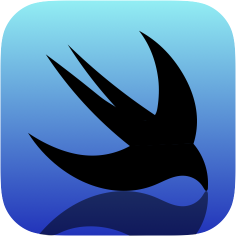

<div align="center">

<h1>AutoPreviewable</h1>
</div>

# Summary
Make class inheriting UIView correspond to XcodePreviews.The source code is automatically generated by `Sourcery`.  
This was conceived to introduce [StoryboardPreviewsBySwiftUI](https://github.com/AkkeyLab/StoryboardPreviewsBySwiftUI) efficiently.

# Usage
Please copy the following files to work in your environment.  
You can automatically generate code by executing `sourcery_previews.sh`.

|File  |description |
|---    |---   |
|./Sourcery/sourcery_previews.sh  |Execution script file   |
|./Sourcery/sourcery.yml  |Execution configuration file  |
|./Sourcery/templates/AutoPreviewable.stencil    |Sourcery template file |
|./setup.sh|Required software download script file|

If you want to create a preview process, make the class compliant with `AutoPreviewable`.  
The class must be `final class`.  
Note that at this time, auto-generation is only supported for `UIView`.
```swift
protocol AutoPreviewable {}

final class AkkeyView: UIView, AutoPreviewable {
    // do something
}
```
By default, processing is performed assuming that there is an XIB file with the same name as the class name.  
If the XIB file does not exist, specify as follows.
```swift
// sourcery: xibLess
final class AkkeyView: UIView, AutoPreviewable {
    // do something
}
```
To specify the height for previewing, write as follows.
```swift
// sourcery: customHeight=100
final class AkkeyView: UIView, AutoPreviewable {
    // do something
}
```

# License
AutoPreviewable is available under the MIT license. See the LICENSE file for more info.
